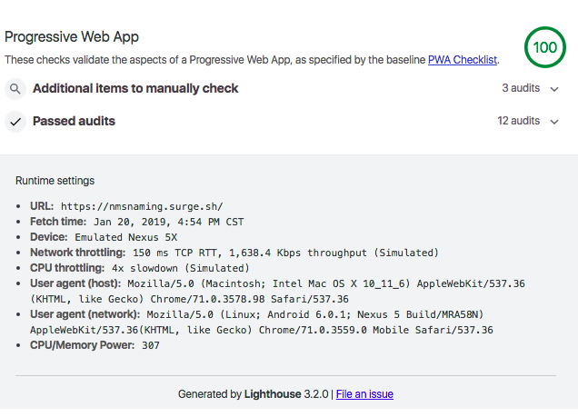

# _No Man's Sky System Name Generator_

#### _NMS Name Gen, 1.1.0, January 2019_

#### By _Jacob Hixon_

## Description

A **Progressive Web App** to create properly formatted star system names for civilized space in the popular video game *No Man's Sky*.

*This app is available offline and can be saved to a smart phone home screen!*
*(See [Progressive Web App](#progressive-web-app) section below)*

### Live

_The live site can be found [here](https://nmsnaming.surge.sh)._

### Progressive Web App

This website is fully-functional as a Progressive Web App, or PWA. To learn more about PWAs, checkout [this Google outline](https://developers.google.com/web/progressive-web-apps/) of what makes a PWA.

This site passes a Lighthouse PWA audit 100%:

## Project Requirements

- _[gatsby-cli](https://www.npmjs.com/package/gatsby-cli)_

## Installation Instructions

1. _Clone into repository located at https://github.com/jacobhixon47/nms-name-gen.git ._
2. _In the terminal, make sure you are inside of the project folder, then run the following commands:_
  * `$ npm install` or `$ npm i`
  * `$ gatsby develop`

3. _Once the project has finished being compiled, visit [localhost:8000](localhost:8000) in your browser.

## Technologies Used

#### Generated with

_[GatsbyJS](https://www.gatsbyjs.org/docs/)_

#### Deployed with

_[Surge](https://surge.sh)_

#### Styled with

_[Emotion](https://emotion.sh) — CSS-in-JS_

### License

This file is part of (nms-name-gen).

    (nms-name-gen) is free software: you can redistribute it and/or modify
    it under the terms of the GNU General Public License as published by
    the Free Software Foundation, either version 3 of the License, or
    (at your option) any later version.

    (nms-name-gen) is distributed in the hope that it will be useful,
    but WITHOUT ANY WARRANTY; without even the implied warranty of
    MERCHANTABILITY or FITNESS FOR A PARTICULAR PURPOSE.  See the
    GNU General Public License for more details.

    You should have received a copy of the GNU General Public License
    along with the (nms-name-gen). If not, see <http://www.gnu.org/licenses/>.

Copyright (c) 2019 **_Jacob Hixon_**
